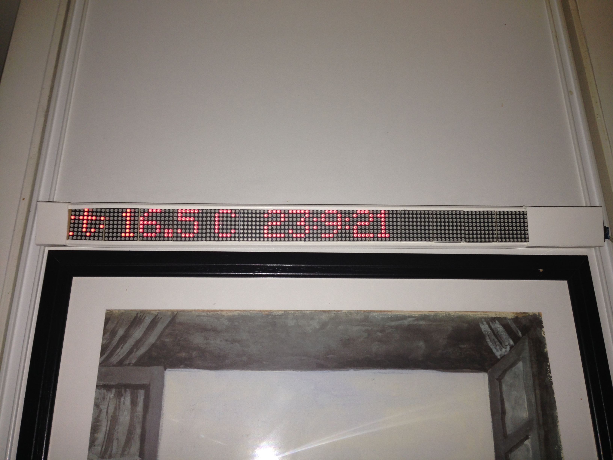
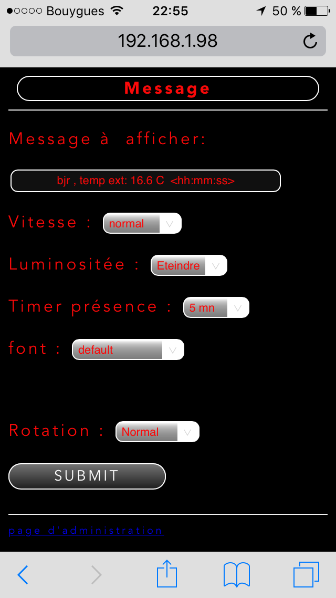

# wifidisplay8x8

Bandeau led pilotable en wifi, avec mode wifi AP pour configuration.

<h2>installation chez moi</h2>

<h2>interface d'administration</h2>

utilise esp8266/Arduino : https://github.com/esp8266/Arduino

Basé sur le code pour l'affichage de 
   https://github.com/SensorsIot/MAX7219-4-digit-display-Library-for-ESP8266-/tree/master/MAX7219_Dot_MatrixESP-master
et pour l'auto config de 
   https://github.com/Orkeren/ESP8266-Arduino-Webconfig

